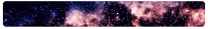

<link rel="preconnect" href="https://fonts.googleapis.com">
<link rel="preconnect" href="https://fonts.gstatic.com" crossorigin>
<link href="https://fonts.googleapis.com/css2?family=Press+Start+2P&display=swap" rel="stylesheet">

   Hello there! I am Andreea, welcome to my profile!

<!--
- 🔭 I’m currently working on ...
- 🌱 I’m currently learning ...
- 👯 I’m looking to collaborate on ...
- 🤔 I’m looking for help with ...
- 💬 Ask me about ...
- 📫 How to reach me: ...
- 😄 Pronouns: ...
- ⚡ Fun fact: ...
-->

   

* I'm currently working on #30NitesOfCode on Codédex challenge and I am doing some fun projects and learn new things
* I'm currently learning HTML, CSS, JavaScript and Bootstrap to create Webpages
* Got my HTML certificate: https://www.codedex.io/certificates/c3c3b600-6684-4486-893b-51c46ba680c8

## #30NitesOfCode:
  [Check out my progress!](https://www.codedex.io/@Andreea/30-nites-of-code)  
  

