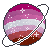
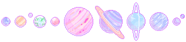
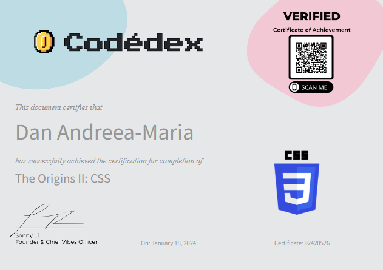
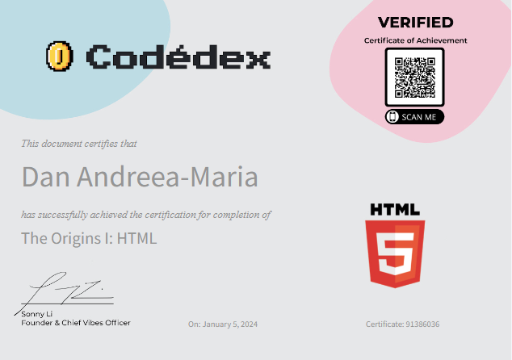
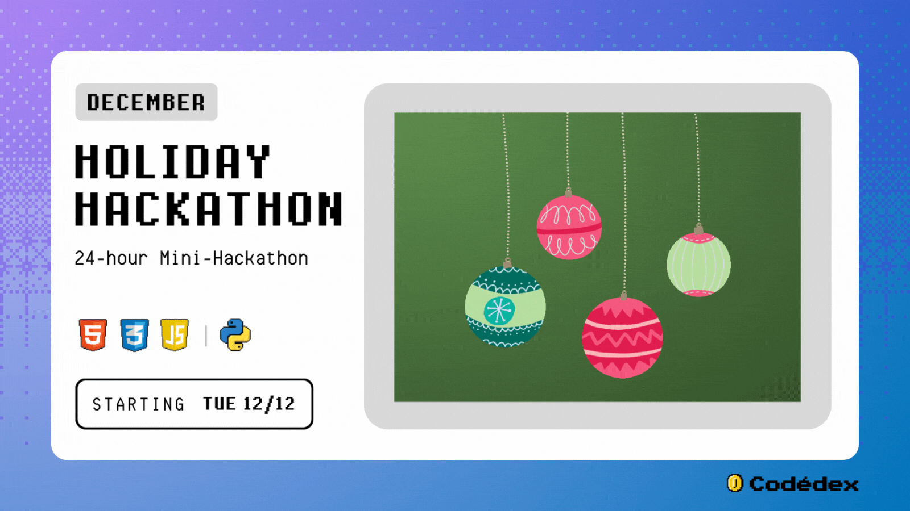
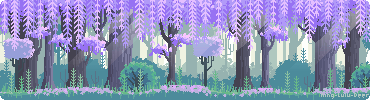

<h1>   
     
 Hello there! I am Andreea, welcome to my profile! </h1>

 
  

  

<h2 align="center">
   
 I am a self-taught web developer. </h2>

<h3 align="center">
   
 I'm currently working on #30NitesOfCode on Codédex challenge and I am doing some fun projects and I am learning new things everyday! Thanks to this challenge, I managed to fill up my GitHub repository with so many projects!</h3>

  

<h1 align="center">
   
 Certificates  </h1> 

  

    

 

  

   <h3>HTML & CSS</h3> 
   
   

  

    

 

  

  

<h1 align="center">
     
Hackathons</h1>

  

<h3 align="center">I participated at my first Hackathon on the Codédex platform - a Holiday themed one and I was among the winners of Best First Time Hack!</h3>

  

     

     
[More details here](https://www.codedex.io/community/monthly-challenge/submission/wXeIxHkeadwXo3AqBOny)

  

  

    

  

  
  

  

###
  

<h1>
     

Languages</h1>
    
  
  
  
  
  
  
  
  
  <!--
  -->
  <!---->
  <!--
  -->
  <!--
  -->

  

  
<h1 align="center"> 

Connect with me</h1>

<!---->

  

   
## #30NitesOfCode
  [Check out my progress!](https://www.codedex.io/@Andreea/30-nites-of-code)  
    
  

